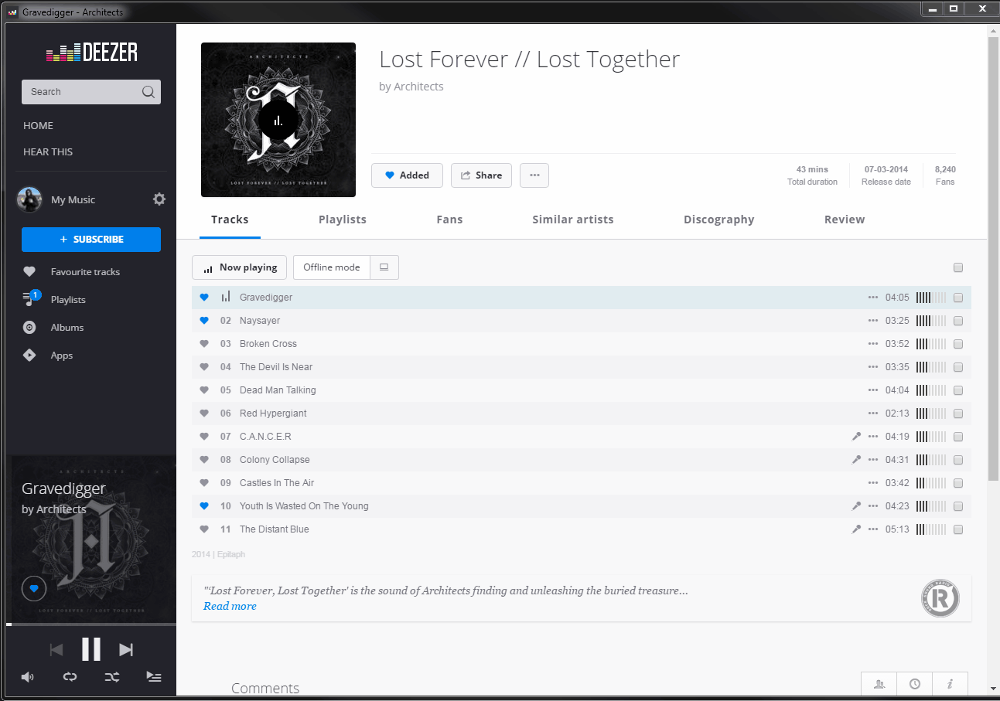

# music-streaming-notify

> Desktop notification for Deezer.
> The album cover art will be saved under %TEMP%\deezer.png and will be shown in the notification area beside the artist, album and song title.

## Deployment
### Client
+ Open [``chrome://extensions``](chrome://extensions)
+ Activate ``Developer mode``
+ Click on ``Load unpacked extension...``
+ Browse to ``client\deezer\``
+ Make sure the ``Deezer.Notify.Client`` extension appears on the ``Extensions`` page
+ Refresh your deezer page
+ Open the dev console ``F12`` and verify that the extension is loaded
``
[deezer-notify-client] Listening...
``

> please note that the extension is deployed as developer extension so you may get an annoying warning from the chrome if restart the chrome

### Server
+ ``cd server``
+ ``npm install``
+ ``npm start`` if you want to start the server manually

##### Windows only setup

######  Deploy as Windows Service

+ navitage to the root folder (e.g ``cd ..`` if you are in the ``server`` folder)
+ ``npm install``  // yes, just do it again
+ ``npm run deploy``
+ configure the windows service if you like
> Hint: cover art will be saved under ``C:\%WINDIR0%\Temp\deezer.png`` 

###### Desktop Notification
+ install [Growl for Windows](http://www.growlforwindows.com/)

